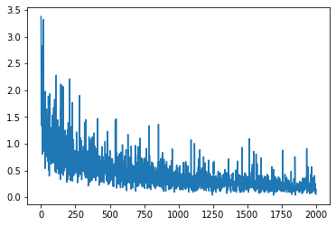
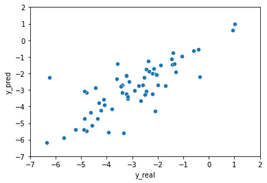

# Understanding-Molecule-Solubility-with-Graph-Neural-Networks
Implementing a Graph Neural Network using Pytorch Geometric and RDKit 

## Objective:

To Develop a Graph Neural Network (GNN) model for predicting the solubility of molecules using the ESOL dataset from the MoleculeNet benchmark.

## Methodology:

The GNN is trained on a set of molecules from the esol dataset from the moleculenet benchmark. The esol dataset has information about the solubility of molecules. 
The model takes in information about the molecule which has been obtained by passing its smile through the RDKit package. Then, the model passes the information about the nodes and edges of the molecule through three layers of message passing (GCNConv class), and then aggregates the information for all the nodes by taking their average and max (and concatenating them) and passing that on to the last layer, which has just one neuron, containing a value, indicating the solubility. 

After 2000 epochs, the MSE loss was around 0.11.

## Results:

After training the model for 2000 epochs, achieved a Mean Squared Error (MSE) loss of approximately 0.11, demonstrating the effectiveness of the GNN architecture in capturing molecular features for solubility prediction.

Loss during training:

Testing the model:

## References:

- https://youtu.be/0YLZXjMHA-8?si=AaZNTFobGGFAx9As
